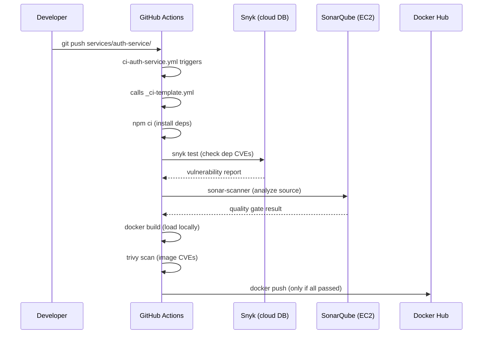
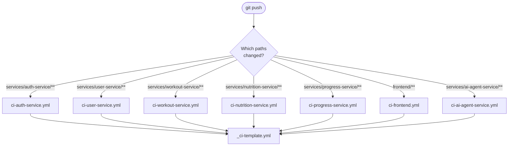

# CI Pipeline Setup — FitForge

## Overview

This guide implements a GitHub Actions CI pipeline for every microservice in the FitForge project using a **reusable workflow template** pattern — one template, one thin caller file per service.

### Pipeline Flow


### Architecture Decisions

| Concern | Choice | Reason |
|---|---|---|
| CI Runner | GitHub-hosted `ubuntu-latest` | No self-hosted runner required |
| SonarQube | Self-hosted on EC2 | No SonarCloud billing |
| Snyk | Snyk CLI (free tier) | Runs inside GitHub Actions, no infra needed |
| Trivy | `aquasecurity/trivy-action` | Runs inside GitHub Actions, no infra needed |
| Per-service CI | Reusable `workflow_call` template | DRY — one template, all services call it |

---

## Repository Structure

After completing this guide, your `.github/workflows/` directory will look like this:

```
.github/
└── workflows/
    ├── _ci-template.yml          ← Reusable template (called by all services)
    ├── ci-frontend.yml
    ├── ci-auth-service.yml
    ├── ci-user-service.yml
    ├── ci-workout-service.yml
    ├── ci-nutrition-service.yml
    ├── ci-progress-service.yml
    └── ci-ai-agent-service.yml
```

Each service also needs a `sonar-project.properties` file in its root:

```
services/
├── auth-service/
│   └── sonar-project.properties
├── user-service/
│   └── sonar-project.properties
├── workout-service/
│   └── sonar-project.properties
├── nutrition-service/
│   └── sonar-project.properties
├── progress-service/
│   └── sonar-project.properties
└── ai-agent-service/
    └── sonar-project.properties
frontend/
└── sonar-project.properties
```

---

## Phase 1 — Set Up SonarQube on EC2

> **Complete this phase before creating any workflow files.**

### Step 1 — Launch EC2 Instance

| Setting | Value |
|---|---|
| AMI | Ubuntu 22.04 LTS |
| Instance type | `t3.medium` (2 vCPU, 4 GB RAM — minimum for SonarQube) |
| Storage | 20 GB gp3 |
| Elastic IP | Yes — assign one so the address is static |

**Security Group — Inbound Rules:**

| Port | Protocol | Source | Purpose |
|------|----------|--------|---------|
| 22 | TCP | Your IP only | SSH access |
| 9000 | TCP | `0.0.0.0/0` | SonarQube UI and API (GitHub Actions calls this) |

### Step 2 — Install Java and SonarQube

SSH into your EC2 instance and run the following:

```bash
# Install Java 17 and unzip
sudo apt update && sudo apt install -y openjdk-17-jdk unzip

# Create a dedicated system user for SonarQube
sudo useradd -m -d /opt/sonarqube sonarqube

# Download SonarQube Community Edition
cd /tmp
wget https://binaries.sonarsource.com/Distribution/sonarqube/sonarqube-10.4.1.88267.zip
sudo unzip sonarqube-10.4.1.88267.zip -d /opt/
sudo mv /opt/sonarqube-10.4.1.88267 /opt/sonarqube
sudo chown -R sonarqube:sonarqube /opt/sonarqube
```

### Step 3 — Configure SonarQube

Edit the configuration file:

```bash
sudo nano /opt/sonarqube/conf/sonar.properties
```

Add or uncomment these lines:

```properties
sonar.web.host=0.0.0.0
sonar.web.port=9000
sonar.search.javaAdditionalOpts=-Dnode.store.allow_mmap=false
```

Increase system limits required by SonarQube's embedded Elasticsearch:

```bash
sudo nano /etc/sysctl.conf
```

Append to the bottom:

```
vm.max_map_count=524288
fs.file-max=131072
```

Apply immediately:

```bash
sudo sysctl -p
```

### Step 4 — Run SonarQube as a System Service

Create the service file:

```bash
sudo nano /etc/systemd/system/sonarqube.service
```

Paste this content:

```ini
[Unit]
Description=SonarQube
After=network.target

[Service]
Type=forking
ExecStart=/opt/sonarqube/bin/linux-x86-64/sonar.sh start
ExecStop=/opt/sonarqube/bin/linux-x86-64/sonar.sh stop
User=sonarqube
Group=sonarqube
Restart=always
LimitNOFILE=65536
LimitNPROC=4096

[Install]
WantedBy=multi-user.target
```

Enable and start the service:

```bash
sudo systemctl daemon-reload
sudo systemctl enable sonarqube
sudo systemctl start sonarqube

# Wait ~60 seconds then verify
sudo systemctl status sonarqube
```

### Step 5 — First-time SonarQube Configuration

1. Open `http://<YOUR-EC2-ELASTIC-IP>:9000` in your browser
2. Log in with `admin` / `admin` and **change the password immediately**
3. Go to **Administration → Security → Users** → create a user named `ci-bot`
4. Click on `ci-bot` → **Tokens** → generate a token named `github-actions`
   > **Copy this token now — it will not be shown again**
5. Go to **Administration → Projects → Create Project Manually** and create one project per service:

| Project Key | Display Name |
|---|---|
| `fitforge-auth-service` | FitForge Auth Service |
| `fitforge-user-service` | FitForge User Service |
| `fitforge-workout-service` | FitForge Workout Service |
| `fitforge-nutrition-service` | FitForge Nutrition Service |
| `fitforge-progress-service` | FitForge Progress Service |
| `fitforge-frontend` | FitForge Frontend |
| `fitforge-ai-agent-service` | FitForge AI Agent Service |

---

## Phase 2 — Configure GitHub Secrets and Variables

### Secrets

Go to **Settings → Secrets and variables → Actions → New repository secret** and add:

| Secret Name | Value |
|---|---|
| `SONAR_HOST_URL` | `http://<YOUR-EC2-ELASTIC-IP>:9000` |
| `SONAR_TOKEN` | The token generated for `ci-bot` in SonarQube |
| `SNYK_TOKEN` | Your Snyk API token — see [`snyk-setup.md`](./snyk-setup.md) |
| `DOCKER_PASSWORD` | Your Docker Hub password or access token |

### Variables

Go to **Settings → Secrets and variables → Actions → Variables tab → New repository variable** and add:

| Variable Name | Value |
|---|---|
| `DOCKER_USERNAME` | Your Docker Hub username |

---

## Phase 3 — Reusable CI Template

Create `.github/workflows/_ci-template.yml`. This file is called by every service workflow — it is never triggered directly.

```yaml
# _ci-template.yml
# Reusable workflow — invoked by each per-service workflow via workflow_call.
# Never triggered directly by a push or PR.

name: CI Template

on:
  workflow_call:
    inputs:
      service-name:
        required: true
        type: string
      service-path:
        required: true
        type: string
      sonar-project-key:
        required: true
        type: string
      docker-image:
        required: true
        type: string
      runtime:
        required: false
        type: string
        default: "node"
      node-version:
        required: false
        type: string
        default: "20"
      python-version:
        required: false
        type: string
        default: "3.11"
    secrets:
      SONAR_HOST_URL:
        required: true
      SONAR_TOKEN:
        required: true
      SNYK_TOKEN:
        required: true
      DOCKER_USERNAME:
        required: true
      DOCKER_PASSWORD:
        required: true

jobs:
  ci:
    name: "CI — ${{ inputs.service-name }}"
    runs-on: ubuntu-latest
    defaults:
      run:
        working-directory: ${{ inputs.service-path }}

    steps:

      # ────────────────────────────────────────────────────────────
      # 1. CHECKOUT
      # fetch-depth: 0 is required for SonarQube blame analysis
      # ────────────────────────────────────────────────────────────
      - name: Checkout code
        uses: actions/checkout@v4
        with:
          fetch-depth: 0

      # ────────────────────────────────────────────────────────────
      # 2. SETUP RUNTIME
      # ────────────────────────────────────────────────────────────
      - name: Setup Node.js
        if: inputs.runtime == 'node'
        uses: actions/setup-node@v4
        with:
          node-version: ${{ inputs.node-version }}
          cache: "npm"
          cache-dependency-path: "${{ inputs.service-path }}/package-lock.json"

      - name: Setup Python
        if: inputs.runtime == 'python'
        uses: actions/setup-python@v5
        with:
          python-version: ${{ inputs.python-version }}
          cache: "pip"

      # ────────────────────────────────────────────────────────────
      # 3. INSTALL DEPENDENCIES
      # ────────────────────────────────────────────────────────────
      - name: Install Node dependencies
        if: inputs.runtime == 'node'
        run: npm ci

      - name: Install Python dependencies
        if: inputs.runtime == 'python'
        run: pip install -r requirements.txt

      # ────────────────────────────────────────────────────────────
      # 4. SNYK — Software Composition Analysis
      # Scans package dependencies for known CVEs.
      # || true keeps it report-only; remove || true to block on HIGH+
      # ────────────────────────────────────────────────────────────
      - name: Setup Snyk CLI
        uses: snyk/actions/setup@master

      - name: Snyk — Scan dependencies (Node)
        if: inputs.runtime == 'node'
        run: snyk test --severity-threshold=high --json > snyk-report.json || true
        env:
          SNYK_TOKEN: ${{ secrets.SNYK_TOKEN }}

      - name: Snyk — Scan dependencies (Python)
        if: inputs.runtime == 'python'
        run: snyk test --file=requirements.txt --package-manager=pip --severity-threshold=high --json > snyk-report.json || true
        env:
          SNYK_TOKEN: ${{ secrets.SNYK_TOKEN }}

      - name: Upload Snyk report
        uses: actions/upload-artifact@v4
        if: always()
        with:
          name: snyk-report-${{ inputs.service-name }}
          path: ${{ inputs.service-path }}/snyk-report.json
          retention-days: 14

      # ────────────────────────────────────────────────────────────
      # 5. SONARQUBE — Static Application Security Testing
      # Scans source code for bugs, code smells, and security hotspots.
      # Connects to the self-hosted SonarQube server on EC2.
      # ────────────────────────────────────────────────────────────
      - name: SonarQube Scan (Node / JS)
        if: inputs.runtime == 'node'
        uses: SonarSource/sonarqube-scan-action@v5
        with:
          projectBaseDir: ${{ inputs.service-path }}
          args: >
            -Dsonar.projectKey=${{ inputs.sonar-project-key }}
            -Dsonar.sources=src
            -Dsonar.exclusions=**/node_modules/**,**/*.test.js
        env:
          SONAR_TOKEN: ${{ secrets.SONAR_TOKEN }}
          SONAR_HOST_URL: ${{ secrets.SONAR_HOST_URL }}

      - name: SonarQube Scan (Python)
        if: inputs.runtime == 'python'
        uses: SonarSource/sonarqube-scan-action@v5
        with:
          projectBaseDir: ${{ inputs.service-path }}
          args: >
            -Dsonar.projectKey=${{ inputs.sonar-project-key }}
            -Dsonar.sources=.
            -Dsonar.exclusions=**/__pycache__/**,**/venv/**
            -Dsonar.python.version=${{ inputs.python-version }}
        env:
          SONAR_TOKEN: ${{ secrets.SONAR_TOKEN }}
          SONAR_HOST_URL: ${{ secrets.SONAR_HOST_URL }}

      # ────────────────────────────────────────────────────────────
      # 6. DOCKER BUILD
      # Build the image but do NOT push yet — Trivy scans it first.
      # load: true puts the image in the local daemon for Trivy.
      # ────────────────────────────────────────────────────────────
      - name: Set up Docker Buildx
        uses: docker/setup-buildx-action@v3

      - name: Login to Docker Hub
        uses: docker/login-action@v3
        with:
          username: ${{ secrets.DOCKER_USERNAME }}
          password: ${{ secrets.DOCKER_PASSWORD }}

      - name: Build Docker image
        uses: docker/build-push-action@v6
        with:
          context: ${{ inputs.service-path }}
          push: false
          load: true
          tags: ${{ inputs.docker-image }}:${{ github.sha }}
          cache-from: type=gha
          cache-to: type=gha,mode=max

      # ────────────────────────────────────────────────────────────
      # 7. TRIVY — Container Image Scan
      # Scans the built image for OS package and app layer CVEs.
      # exit-code: "1" causes pipeline to fail on CRITICAL / HIGH CVEs.
      # Results are uploaded to the GitHub Security tab as SARIF.
      # ────────────────────────────────────────────────────────────
      - name: Trivy — Scan container image
        uses: aquasecurity/trivy-action@0.28.0
        with:
          image-ref: "${{ inputs.docker-image }}:${{ github.sha }}"
          format: "sarif"
          output: "trivy-report.sarif"
          severity: "CRITICAL,HIGH"
          exit-code: "1"

      - name: Upload Trivy report to GitHub Security tab
        uses: github/codeql-action/upload-sarif@v3
        if: always()
        with:
          sarif_file: "trivy-report.sarif"
          category: "trivy-${{ inputs.service-name }}"

      # ────────────────────────────────────────────────────────────
      # 8. DOCKER PUSH
      # Only reached if Snyk, SonarQube, and Trivy all passed.
      # Tags with both the commit SHA (immutable) and latest.
      # ────────────────────────────────────────────────────────────
      - name: Push Docker image to Docker Hub
        uses: docker/build-push-action@v6
        with:
          context: ${{ inputs.service-path }}
          push: true
          tags: |
            ${{ inputs.docker-image }}:${{ github.sha }}
            ${{ inputs.docker-image }}:latest
          cache-from: type=gha
          cache-to: type=gha,mode=max
```

---

## Phase 4 — Per-Service Workflow Files

Each service has its own trigger file. The `paths:` filter ensures CI only runs when **that specific service** changes — not on every push to the repo.

### `ci-auth-service.yml`

```yaml
name: CI — Auth Service

on:
  push:
    branches: [main, develop]
    paths:
      - "services/auth-service/**"
      - ".github/workflows/ci-auth-service.yml"
  pull_request:
    branches: [main]
    paths:
      - "services/auth-service/**"

jobs:
  ci:
    uses: ./.github/workflows/_ci-template.yml
    with:
      service-name: auth-service
      service-path: services/auth-service
      sonar-project-key: fitforge-auth-service
      docker-image: ${{ vars.DOCKER_USERNAME }}/fitforge-auth-service
      runtime: node
      node-version: "20"
    secrets: inherit
```

### `ci-user-service.yml`

```yaml
name: CI — User Service

on:
  push:
    branches: [main, develop]
    paths:
      - "services/user-service/**"
      - ".github/workflows/ci-user-service.yml"
  pull_request:
    branches: [main]
    paths:
      - "services/user-service/**"

jobs:
  ci:
    uses: ./.github/workflows/_ci-template.yml
    with:
      service-name: user-service
      service-path: services/user-service
      sonar-project-key: fitforge-user-service
      docker-image: ${{ vars.DOCKER_USERNAME }}/fitforge-user-service
      runtime: node
      node-version: "20"
    secrets: inherit
```

### `ci-workout-service.yml`

```yaml
name: CI — Workout Service

on:
  push:
    branches: [main, develop]
    paths:
      - "services/workout-service/**"
      - ".github/workflows/ci-workout-service.yml"
  pull_request:
    branches: [main]
    paths:
      - "services/workout-service/**"

jobs:
  ci:
    uses: ./.github/workflows/_ci-template.yml
    with:
      service-name: workout-service
      service-path: services/workout-service
      sonar-project-key: fitforge-workout-service
      docker-image: ${{ vars.DOCKER_USERNAME }}/fitforge-workout-service
      runtime: node
      node-version: "20"
    secrets: inherit
```

### `ci-nutrition-service.yml`

```yaml
name: CI — Nutrition Service

on:
  push:
    branches: [main, develop]
    paths:
      - "services/nutrition-service/**"
      - ".github/workflows/ci-nutrition-service.yml"
  pull_request:
    branches: [main]
    paths:
      - "services/nutrition-service/**"

jobs:
  ci:
    uses: ./.github/workflows/_ci-template.yml
    with:
      service-name: nutrition-service
      service-path: services/nutrition-service
      sonar-project-key: fitforge-nutrition-service
      docker-image: ${{ vars.DOCKER_USERNAME }}/fitforge-nutrition-service
      runtime: node
      node-version: "20"
    secrets: inherit
```

### `ci-progress-service.yml`

```yaml
name: CI — Progress Service

on:
  push:
    branches: [main, develop]
    paths:
      - "services/progress-service/**"
      - ".github/workflows/ci-progress-service.yml"
  pull_request:
    branches: [main]
    paths:
      - "services/progress-service/**"

jobs:
  ci:
    uses: ./.github/workflows/_ci-template.yml
    with:
      service-name: progress-service
      service-path: services/progress-service
      sonar-project-key: fitforge-progress-service
      docker-image: ${{ vars.DOCKER_USERNAME }}/fitforge-progress-service
      runtime: node
      node-version: "20"
    secrets: inherit
```

### `ci-frontend.yml`

```yaml
name: CI — Frontend

on:
  push:
    branches: [main, develop]
    paths:
      - "frontend/**"
      - ".github/workflows/ci-frontend.yml"
  pull_request:
    branches: [main]
    paths:
      - "frontend/**"

jobs:
  ci:
    uses: ./.github/workflows/_ci-template.yml
    with:
      service-name: frontend
      service-path: frontend
      sonar-project-key: fitforge-frontend
      docker-image: ${{ vars.DOCKER_USERNAME }}/fitforge-frontend
      runtime: node
      node-version: "20"
    secrets: inherit
```

### `ci-ai-agent-service.yml`

```yaml
name: CI — AI Agent Service

on:
  push:
    branches: [main, develop]
    paths:
      - "services/ai-agent-service/**"
      - ".github/workflows/ci-ai-agent-service.yml"
  pull_request:
    branches: [main]
    paths:
      - "services/ai-agent-service/**"

jobs:
  ci:
    uses: ./.github/workflows/_ci-template.yml
    with:
      service-name: ai-agent-service
      service-path: services/ai-agent-service
      sonar-project-key: fitforge-ai-agent-service
      docker-image: ${{ vars.DOCKER_USERNAME }}/fitforge-ai-agent-service
      runtime: python
      python-version: "3.11"
    secrets: inherit
```

---

## Phase 5 — SonarQube Properties Files

Create a `sonar-project.properties` file in each service root. SonarQube reads this to know which files to scan.

### Node services (auth, user, workout, nutrition, progress)

Replace `<service-name>` and `<Display Name>` for each service:

```properties
sonar.projectKey=fitforge-<service-name>
sonar.projectName=FitForge <Display Name>
sonar.sources=src
sonar.exclusions=**/node_modules/**,**/*.test.js,**/*.spec.js
sonar.javascript.lcov.reportPaths=coverage/lcov.info
```

Example for `services/auth-service/sonar-project.properties`:

```properties
sonar.projectKey=fitforge-auth-service
sonar.projectName=FitForge Auth Service
sonar.sources=src
sonar.exclusions=**/node_modules/**,**/*.test.js,**/*.spec.js
sonar.javascript.lcov.reportPaths=coverage/lcov.info
```

### Frontend — `frontend/sonar-project.properties`

```properties
sonar.projectKey=fitforge-frontend
sonar.projectName=FitForge Frontend
sonar.sources=src
sonar.exclusions=**/node_modules/**,**/*.test.jsx,**/*.spec.jsx,**/dist/**
sonar.javascript.lcov.reportPaths=coverage/lcov.info
```

### AI Agent Service — `services/ai-agent-service/sonar-project.properties`

```properties
sonar.projectKey=fitforge-ai-agent-service
sonar.projectName=FitForge AI Agent Service
sonar.sources=.
sonar.exclusions=**/__pycache__/**,**/venv/**,**/.env
sonar.python.version=3.11
```

---

## How It All Works Together



### Trigger Isolation

Because each workflow uses `paths:` filtering, only the changed service runs CI:



---

## Security Tool Summary

| Tool | Scans | Blocks Pipeline On |
|---|---|---|
| **Snyk** | npm / pip dependency CVEs | HIGH+ (currently report-only via `\|\| true`) |
| **SonarQube** | Source code bugs and security hotspots | Quality Gate failure |
| **Trivy** | Built Docker image — OS + app layer CVEs | CRITICAL or HIGH CVEs |

> **Note on Snyk blocking:** The template uses `|| true` so Snyk reports findings without failing the pipeline. Once you have resolved the initial backlog of vulnerabilities, remove `|| true` from the Snyk steps to enforce hard blocking.

---

## Troubleshooting

| Problem | Cause | Fix |
|---|---|---|
| SonarQube — `Connection refused` | EC2 port 9000 blocked | Allow `0.0.0.0/0` on port 9000 in Security Group |
| SonarQube — `vm.max_map_count` error | Kernel setting too low | `sudo sysctl -w vm.max_map_count=524288` on EC2 |
| SonarQube — service won't start | Wrong user permissions | `sudo chown -R sonarqube:sonarqube /opt/sonarqube` |
| Snyk — `missing SNYK_TOKEN` | Secret not set | Add `SNYK_TOKEN` in GitHub → Settings → Secrets |
| Trivy — exits with code 1 | CRITICAL/HIGH CVEs found | Fix CVEs or temporarily set `exit-code: "0"` |
| Docker push fails | Bad credentials | Check `DOCKER_USERNAME` variable and `DOCKER_PASSWORD` secret |
| Wrong service CI triggers | `paths:` misconfigured | Verify the path filter matches your actual folder structure |
